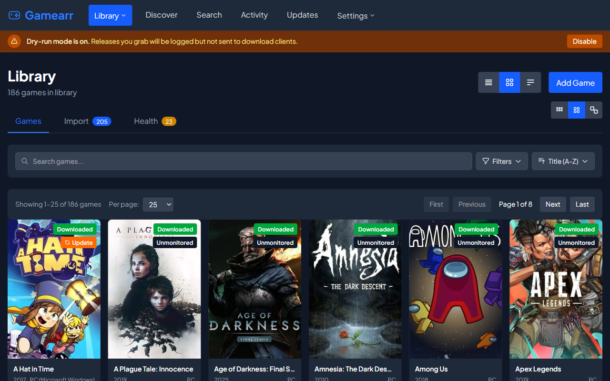

# Gamearr

Automated game library management for self-hosters. Part of the *arr ecosystem.

[](https://discord.gg/rd2gRszhbj)

Gamearr monitors your wanted games, automatically searches for releases via Prowlarr, downloads them through qBittorrent, and organizes your library - just like Radarr does for movies.



## Features

- **IGDB Integration** - Search and add games with full metadata (cover art, year, platforms, descriptions)
- **Steam Import** - Import your Steam library with one click
- **GOG Import** - Import your GOG Galaxy library via OAuth login
- **Prowlarr Integration** - Search multiple torrent indexers for game releases
- **qBittorrent Integration** - Automated download management with progress tracking
- **Library Scanning** - Scan existing game folders and match to database
- **Library Health** - Detect duplicate games and organize loose files
- **RSS Automation** - Automatically grab new releases matching your wanted games
- **Quality Scoring** - Intelligent release selection (prefers GOG, DRM-Free, repacks)
- **Update Monitoring** - Track game updates and new versions
- **Multi-Library Support** - Organize games across multiple library paths
- **Multiple View Modes** - Posters, table, or detailed overview

## Installation

### Docker (Recommended)

```bash
docker run -d \
  --name gamearr \
  -p 7878:7878 \
  -v /path/to/config:/config \
  -v /path/to/library:/library \
  -v /path/to/downloads:/downloads \
  --restart unless-stopped \
  ghcr.io/forbesgryan/gamearr:latest
```

Or with docker-compose:

```yaml
version: "3"
services:
  gamearr:
    image: ghcr.io/forbesgryan/gamearr:latest
    container_name: gamearr
    ports:
      - 7878:7878
    volumes:
      - ./config:/config
      - /path/to/library:/library
      - /path/to/downloads:/downloads
    environment:
      - TZ=America/New_York
    restart: unless-stopped
```

### Pre-built Binary

Download the latest release from the [Releases](https://github.com/ForbesGRyan/gamearr/releases) page.

The binary is fully self-contained - it embeds the web UI and requires no additional files to run.

```bash
# Linux/macOS
chmod +x gamearr
./gamearr

# Windows
gamearr.exe
```

The server starts on port `7878` by default. Open http://localhost:7878 in your browser.

### From Source

Requires [Bun](https://bun.sh) 1.0+.

**Prerequisites:**
- [Prowlarr](https://prowlarr.com/) (for indexer management)
- [qBittorrent](https://www.qbittorrent.org/) with Web UI enabled
- [IGDB API credentials](https://dev.twitch.tv/console) (free via Twitch Developer Console)

```bash
# Clone and install
git clone https://github.com/ForbesGRyan/gamearr.git
cd gamearr
bun install
cd src/web && bun install && cd ../..

# Configure environment
cp .env.example .env
# Edit .env with your credentials

# Initialize database
bun run db:push

# Start development servers
bun run dev:all
```

Open http://localhost:3000 (dev) or http://localhost:7878 (production) in your browser.

## Configuration

### Required Settings

Configure these in the Settings page (http://localhost:3000/settings):

| Setting | Description |
|---------|-------------|
| **IGDB Client ID/Secret** | From [Twitch Developer Console](https://dev.twitch.tv/console) |
| **Prowlarr URL** | e.g., `http://localhost:9696` |
| **Prowlarr API Key** | Found in Prowlarr Settings > General |
| **qBittorrent Host** | e.g., `http://localhost:8080` |
| **qBittorrent Username/Password** | Web UI credentials |
| **Library Path** | Where your games are stored |

### Optional Settings

| Setting | Description |
|---------|-------------|
| **Prowlarr Categories** | Filter search to specific categories (e.g., Games/PC) |
| **qBittorrent Category** | Category for Gamearr downloads |
| **Dry-Run Mode** | Log downloads without actually grabbing |
| **Steam API Key** | From [Steam Web API](https://steamcommunity.com/dev/apikey) for library import |
| **Steam ID** | Your 64-bit Steam ID for library import |
| **GOG Account** | Login via OAuth in Settings > Metadata |

### Environment Variables

All settings can be configured via the web UI, but environment variables take precedence when set. This is useful for Docker deployments or when you want to keep secrets out of the database.

#### System

| Variable | Default | Description |
|----------|---------|-------------|
| `PORT` | `7878` | HTTP server port |
| `DATA_PATH` | `./data` | Directory for SQLite database and data files |
| `LOG_PATH` | `$DATA_PATH/logs` | Directory for log files |
| `NODE_ENV` | `production` | Set to `development` for debug logging |
| `DISABLE_SEMANTIC_SEARCH` | - | Set to `true` to disable semantic search feature |
| `TZ` | - | Timezone (e.g., `America/New_York`) |

#### Service Credentials

These environment variables override database settings when set:

| Variable | Description |
|----------|-------------|
| `QBITTORRENT_HOST` | qBittorrent Web UI URL (e.g., `http://localhost:8080`) |
| `QBITTORRENT_USERNAME` | qBittorrent username |
| `QBITTORRENT_PASSWORD` | qBittorrent password |
| `PROWLARR_URL` | Prowlarr URL (e.g., `http://localhost:9696`) |
| `PROWLARR_API_KEY` | Prowlarr API key |
| `IGDB_CLIENT_ID` | IGDB/Twitch Client ID |
| `IGDB_CLIENT_SECRET` | IGDB/Twitch Client Secret |
| `STEAM_API_KEY` | Steam Web API key |
| `STEAM_ID` | Your 64-bit Steam ID |
| `GOG_REFRESH_TOKEN` | GOG OAuth refresh token (set automatically via OAuth flow) |
| `DISCORD_WEBHOOK_URL` | Discord webhook for notifications |

#### Docker Example

```yaml
services:
  gamearr:
    image: ghcr.io/forbesgryan/gamearr:latest
    ports:
      - 7878:7878
    volumes:
      - ./config:/config
      - /path/to/library:/library
    environment:
      - TZ=America/New_York
      - DATA_PATH=/config
      - PROWLARR_URL=http://prowlarr:9696
      - PROWLARR_API_KEY=your-api-key
      - QBITTORRENT_HOST=http://qbittorrent:8080
      - QBITTORRENT_USERNAME=admin
      - QBITTORRENT_PASSWORD=adminadmin
      - IGDB_CLIENT_ID=your-client-id
      - IGDB_CLIENT_SECRET=your-client-secret
```

## Usage

### Adding Games

1. Go to **Library** page
2. Click **Add Game**
3. Search for a game by name
4. Select the game and click **Add to Library**

### Manual Search

1. Click on a game in your library
2. Click **Search Releases**
3. Review available releases and quality scores
4. Click **Grab** to download

### Automatic Downloads

Gamearr runs two background jobs:

- **RSS Sync** (every 15 min) - Checks indexers for new releases matching wanted games
- **Search Scheduler** (every 15 min) - Actively searches for all wanted games

Games meeting the auto-grab criteria (score >= 100, seeders >= 5) are automatically downloaded.

### Library Import

1. Go to **Library** page and click the **Import** tab
2. Click **Refresh Scan** to scan your library folder
3. Unmatched folders appear with an **Auto Match** button
4. Click **Auto Match** to search IGDB, or **Match** to search manually
5. Confirm the match to add the game as "downloaded"

### Steam/GOG Import

Import your existing game libraries from Steam or GOG:

**Steam:**
1. Go to **Settings > Metadata** and enter your Steam API Key and Steam ID
2. Go to **Library > Import** and click **Import** under Steam
3. Select games to import and click **Import Selected**

**GOG:**
1. Go to **Settings > Metadata** and click **Login with GOG**
2. Log in to GOG in the popup, then copy the redirect URL back to Gamearr
3. Go to **Library > Import** and click **Import** under GOG
4. Select games to import and click **Import Selected**

Imported games are automatically matched with IGDB metadata and marked as "downloaded".

### Library Health

The **Health** tab helps keep your library organized:

**Duplicate Detection**
- Finds games with similar titles (>80% match)
- Shows both games side-by-side with sizes
- Click **Dismiss** to hide false positives

**Loose Files**
- Detects standalone archives (.iso, .rar, .zip, .7z) in your library
- Click **Organize** to create a folder and move the file into it
- Organized files then appear in the Import tab for matching

## API Endpoints

All endpoints prefixed with `/api/v1`:

| Endpoint | Method | Description |
|----------|--------|-------------|
| `/games` | GET | List all games |
| `/games` | POST | Add a game |
| `/games/:id` | GET/PUT/DELETE | Game CRUD |
| `/search/games?q=` | GET | Search IGDB |
| `/search/releases/:id` | POST | Search releases for game |
| `/search/grab` | POST | Grab a release |
| `/downloads` | GET | Active downloads |
| `/downloads/test` | GET | Test qBittorrent connection |
| `/indexers` | GET | List Prowlarr indexers |
| `/indexers/test` | GET | Test Prowlarr connection |
| `/settings/:key` | GET/PUT | Get/set setting |
| `/system/status` | GET | Basic health check |
| `/system/health` | GET | Detailed health with service status |
| `/library/scan` | GET/POST | Get cached / refresh library scan |
| `/library/auto-match` | POST | Auto-match folder to IGDB |
| `/library/match` | POST | Match folder to game |
| `/library/health/duplicates` | GET | Find potential duplicate games |
| `/library/health/loose-files` | GET | Find loose archive files |
| `/library/health/organize-file` | POST | Organize loose file into folder |
| `/steam/test` | GET | Test Steam connection |
| `/steam/owned-games` | GET | Get Steam library |
| `/steam/import-stream` | POST | Import Steam games (SSE) |
| `/gog/auth/url` | GET | Get GOG OAuth URL |
| `/gog/auth/exchange` | POST | Exchange GOG auth code |
| `/gog/test` | GET | Test GOG connection |
| `/gog/owned-games` | GET | Get GOG library |
| `/gog/import-stream` | POST | Import GOG games (SSE) |

## Development

### Commands

```bash
# Development (both servers)
bun run dev:all

# Or separately:
bun dev          # Backend on :7878
bun dev:web      # Frontend on :3000

# Database
bun run db:push    # Push schema changes
bun run db:studio  # Open Drizzle Studio

# Production build
bun run build      # Creates ./gamearr binary (self-contained with embedded UI)
./gamearr          # Run on :7878

# Testing
bun test           # Run all tests
bun test --watch   # Watch mode
```

### Build Process

The production build creates a single executable with the web UI embedded:

1. `build:web` - Compiles React frontend to `dist/`
2. `build:vfs` - Packs `dist/` into a Virtual File System module
3. `bun build --compile` - Compiles server + embedded VFS into a single binary

This means the `gamearr` binary can be deployed anywhere without additional files.

### Project Structure

```
gamearr/
├── src/
│   ├── server/
│   │   ├── routes/          # API endpoints
│   │   ├── services/        # Business logic
│   │   ├── repositories/    # Database access
│   │   ├── integrations/    # IGDB, Prowlarr, qBittorrent, Steam, GOG clients
│   │   ├── jobs/            # RssSync, SearchScheduler, DownloadMonitor
│   │   ├── middleware/      # Auth, CSRF, rate limiting, embedded static
│   │   ├── generated/       # Auto-generated VFS for embedded frontend
│   │   ├── db/              # Drizzle schema
│   │   └── utils/           # Logger, errors, HTTP helpers
│   └── web/
│       └── src/
│           ├── pages/       # Library, Activity, Settings, Discover, etc.
│           ├── components/  # GameCard, AddGameModal, etc.
│           └── api/         # API client
├── scripts/                 # Build scripts (VFS generator)
├── tests/                   # Unit tests
├── data/                    # SQLite database (runtime)
└── dist/                    # Frontend build output
```

## Quality Scoring

Releases are scored based on:

| Factor | Points |
|--------|--------|
| Title match | +50 |
| Year match | +20 |
| GOG release | +50 |
| DRM-Free | +40 |
| Repack | +20 |
| Scene release | +10 |
| High seeders (20+) | +10 |
| Low seeders (<5) | -30 |
| Old release (>2 years) | -20 |
| Suspicious size | -50 |

**Auto-grab threshold:** score >= 100 AND seeders >= 5

## Troubleshooting

### Connection Issues

Use the **Test Connection** buttons in Settings to verify:
- Prowlarr is reachable and API key is correct
- qBittorrent Web UI is enabled and credentials are correct

### No Search Results

- Check Prowlarr has indexers configured
- Verify category filters match your indexers
- Try a manual search with simpler terms

### Downloads Not Starting

- Check qBittorrent connection
- Verify the download URL/magnet is valid
- Check qBittorrent logs for errors
- Try enabling Dry-Run mode to see what would be grabbed

## License

This project is licensed under the GPL-3.0 License - see the [LICENSE](LICENSE) file for details.

## Acknowledgments

- [IGDB](https://www.igdb.com/) for game metadata
- Inspired by [Radarr](https://github.com/Radarr/Radarr), [Sonarr](https://github.com/Sonarr/Sonarr), and the *arr ecosystem
